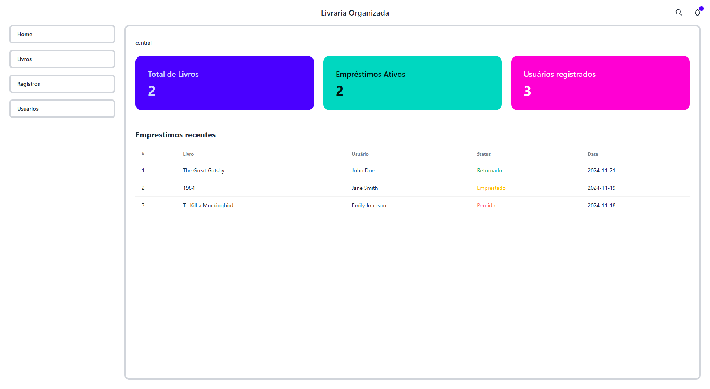

# Livraria Organizada

## Sistema de Gerenciamento de Empréstimos de Livros com RFID e NFC



Este projeto é um sistema moderno para gerenciar empréstimos de livros em uma biblioteca, utilizando **Fresh.js**, **TypeScript**, **NestJS**, **Prisma**, **SQLite** e integração com **Arduino**. A interação com o sistema é feita através de cartões **NFC** para identificar usuários e etiquetas **RFID** para identificar livros.

## 🚀 Funcionalidades

- **Gerenciamento de livros:**
  - Cadastro, listagem, edição e exclusão.
  - Controle de disponibilidade.
- **Empréstimos e devoluções:**
  - Registro de entrada e saída com identificação do usuário via **NFC**.
  - Histórico detalhado das movimentações (livros, usuários e datas).
- **Login via cartão NFC:**
  - Cada usuário possui um cartão NFC para autenticação no sistema.
- **Interface moderna:**
  - Visual amigável e responsivo com **Tailwind CSS**.

---

## 🛠️ Tecnologias Utilizadas

### **Frontend**
- **Fresh.js**: Framework moderno para aplicações web usando **Deno**.
- **TypeScript**: Garantia de segurança e tipagem no código.
- **Tailwind CSS**: Para estilização rápida e responsiva.

### **Backend**
- **NestJS**: Framework para criar servidores escaláveis e eficientes com **TypeScript**.
- **Prisma**: ORM para interagir com o banco de dados **SQLite** de forma eficiente.
- **SQLite**: Banco de dados relacional utilizado para armazenamento das informações da biblioteca.
- **Swagger**: Documentação da API, é possível acessar em `http://localhost:3000/api`

### **Hardware**
- **Arduino**: Leitura de etiquetas **RFID** e cartões **NFC**.
- **Módulo NFC/RFID**: Para captura dos IDs dos livros e usuários.

---

## ⚙️ Fluxo do Sistema

1. **Login com Cartão NFC**:
   - O usuário autentica no sistema ao passar o cartão NFC.
   - O sistema verifica se o ID do cartão está cadastrado e registra a sessão do usuário.

2. **Registro de Empréstimos ou Devoluções**:
   - O livro é identificado ao escanear a etiqueta RFID.
   - O sistema registra automaticamente:
     - **Tipo de movimentação** (empréstimo ou devolução).
     - **Usuário autenticado**.
     - **Data e hora da movimentação**.

3. **Interface Responsiva**:
   - Acompanhamento em tempo real de livros disponíveis e histórico de movimentações.

---

## 🛠️ Instalação e Configuração

### Pré-requisitos

- **Deno** (v1.35+)
- **Node.js** e **NestJS** para rodar o backend
- **Arduino** com suporte a RFID e NFC
- **Módulo RFID/NFC** (ex.: RC522)
- **Git** para clonar o repositório

### Passos para Instalar

1. Clone o repositório:

   ```bash
   git clone https://github.com/seu-usuario/sistema-biblioteca.git
   cd sistema-biblioteca
   ```

2. Instale as dependências do frontend (Fresh.js):

   ```bash
   deno task update
   ```

3. Instale as dependências do backend (NestJS):

   ```bash
   cd backend
   npm install
   ```

4. Configure o banco de dados **SQLite** utilizando o **Prisma**:

   ```bash
   npx prisma migrate dev
   ```

5. Inicie o servidor de backend:

   ```bash
   npm run start
   ```

   O backend estará disponível em [http://localhost:3000](http://localhost:3000).

6. Inicie o servidor de frontend:

   ```bash
   deno task start
   ```

   O frontend estará disponível em [http://localhost:8000](http://localhost:8000).

7. Configure o Arduino para enviar dados para a aplicação.

---

## 📦 Endpoints da API

### **Autenticação**

- **POST /api/auth/login**  
  Registra o login do usuário autenticado com o cartão NFC.  
  Corpo da requisição:

  ```json
  {
    "userId": "abc123"
  }
  ```

### **Livros**

- **GET /api/livros**  
  Retorna a lista de livros cadastrados.

- **POST /api/livros**  
  Adiciona um novo livro:  

  ```json
  {
    "titulo": "Dom Quixote",
    "autor": "Miguel de Cervantes",
    "ano": 1605
  }
  ```

### **Registros**

- **POST /api/registros**  
  Registra uma movimentação de livro:  

  ```json
  {
    "livroId": "livro123",
    "userId": "user123",
    "tipo": "emprestimo"
  }
  ```

---

## 🔌 Integração com RFID e NFC

1. **Configuração do Arduino**:
   - Utilize o módulo RC522 para leitura de RFID e NFC.
   - Faça upload do código localizado em `arduino/leitor_rfid.ino`.

2. **Fluxo de Dados**:
   - O Arduino lê os códigos das etiquetas RFID dos livros e os IDs NFC dos usuários.
   - Os dados são enviados via **serial** ou **WiFi** para o sistema.
   - Exemplo de dado enviado:

     ```json
     {
       "livroId": "rfid123",
       "userId": "nfc456",
       "tipo": "devolucao"
     }
     ```

3. **Conexão**:
   - Certifique-se de que o Arduino está configurado para se comunicar com a API `/api/registros`.

---

## ✨ Próximos Passos

- **Notificações**: Alertas automáticos para devoluções atrasadas.
- **Relatórios Avançados**: Geração de estatísticas sobre empréstimos.
- **Suporte Multidispositivo**: Sincronização com dispositivos móveis.

---

Com este sistema, o gerenciamento de uma biblioteca se torna ágil, moderno e automatizado. Feedbacks e contribuições são bem-vindos! 😊